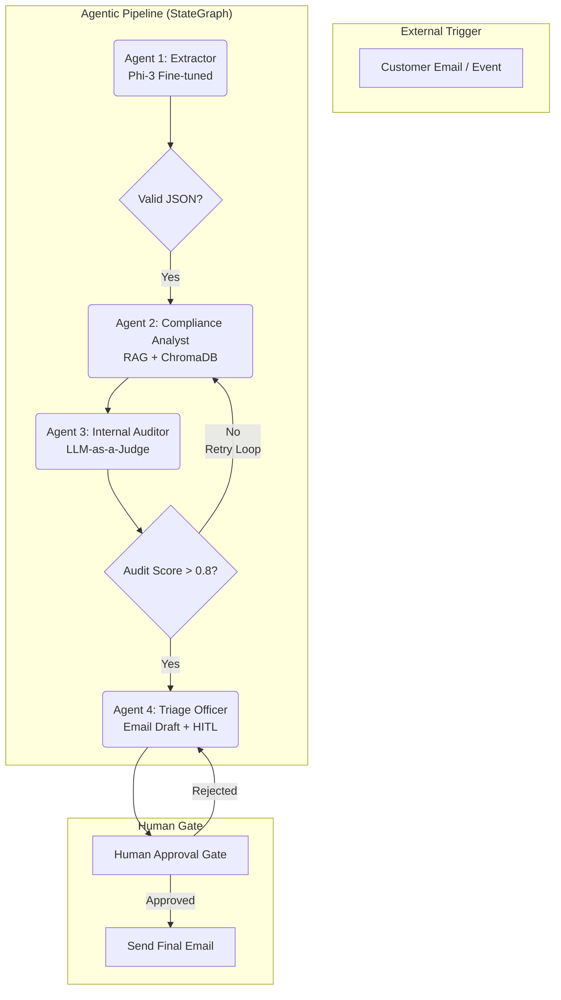

# 🏛️ Technical Architecture V2: Multi-Agent Enterprise Pipeline

> **"The Autonomous Compliance Desk"** — A production-grade multi-agent system orchestrating extraction, research, auditing, and human-in-the-loop triage.

---

## High-Level Orchestration (LangGraph)

This system transforms 4 specialized LLM services into a unified **Stateful Agentic Graph**.

---

## Agent Definitions

### 1. The Data Extractor (Project 3)
*   **Role:** Transforms unstructured input (receipts, policy claims) into a structured schema.
*   **Engine:** Local SLM (Phi-3-mini) fine-tuned with LoRA on the SROIE dataset.
*   **Output:** `AgentState.claim_data` (JSON).

### 2. The Compliance Analyst (Project 1)
*   **Role:** Performs deep research into company policies to determine claim validity.
*   **Engine:** GPT-4o-mini / Llama-3 via RAG (ChromaDB).
*   **Output:** `AgentState.policy_verdict` (Text + Citations).

### 3. The Internal Auditor (Project 2)
*   **Role:** Acting as a "Senior Peer Reviewer," it scores the Analyst's output for hallucinations and relevancy.
*   **Engine:** LLM-as-a-Judge (using RAGAS-style metrics: Faithfulness, Relevancy).
*   **Control:** If the score is low, it updates `AgentState.feedback` and routes the graph back to Agent 2 for correction.

### 4. The Triage Officer (Project 4)
*   **Role:** Synthesizes all data into a professional customer response.
*   **Engine:** LangGraph State management with a persistent checkpointer for the human approval gate.
*   **Output:** `AgentState.final_email`.

---

## Cross-Cutting Concerns

### 🔍 Observability (Langfuse)
A single "Trace ID" spans the entire multi-agent handoff. This allows stakeholders to see exactly where a bottleneck or hallucination occurred (e.g., "Agent 3 caught a hallucination in Agent 2's reasoning").

### 🛡️ Safety & Governance
*   **PII Masking:** Initial scan before Agent 1 processes data.
*   **Audit Trail:** Every audit score and retry loop is logged for compliance.
*   **HITL:** No email is sent without a `requires_approval: false` flag set by a human.

### 💰 Token Stewardship
By using a local SLM for extraction (Agent 1) and `gpt-4o-mini` for research (Agent 2), the system maintains a high ROI while minimizing API costs.

---

*This architecture demonstrates the transition from individual LLM tasks to Compound AI Systems.*
