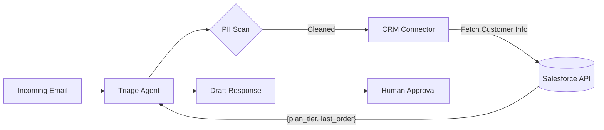

# 🔌 Enterprise CRM & Database Integration Guide

This guide outlines the architectural patterns for connecting the **Autonomous Email Triage Agent** to production Enterprise Resource Planning (ERP) and Customer Relationship Management (CRM) systems like **Salesforce**, **HubSpot**, or **Zendesk**.

---

## 1. Architectural Pattern: The "Data Bridge"

To maintain security and prevent "hallucinations," we never give the LLM direct, write-access to the CRM. Instead, we use a **Retriever-Action Pattern**.



---

## 2. Salesforce Integration Example (via Simple-Salesforce)

To connect this agent to Salesforce, we implement a `CRMTool` class in the `core/` directory.

### Example Implementation:
```python
from simple_salesforce import Salesforce

class SalesforceConnector:
    def __init__(self):
        self.sf = Salesforce(
            username='service_account@company.com',
            password='password',
            security_token='token'
        )

    def get_customer_context(self, email_address: str):
        # Query Salesforce for specific customer metadata
        query = f"SELECT Name, Account_Tier__c, Last_Order_Date__c FROM Contact WHERE Email = '{email_address}'"
        result = self.sf.query(query)
        return result['records'][0] if result['totalSize'] > 0 else None
```

---

## 3. Handling Sensitive Information (PII)

Before sending data to the LLM (Groq/OpenAI), we implement a **Sanitization Layer** using `presidio-analyzer` or custom regex.

### The Privacy Workflow:
1. **Detect**: Identify names, credit cards, and addresses.
2. **Redact**: Replace "John Doe" with `[CUSTOMER_NAME]`.
3. **Process**: Send the redacted text to the LLM.
4. **Rehydrate**: Replace the tokens back with the real info *after* the draft is created, before it reaches the human reviewer.

---

## 4. Production Roadmap: Automated vs. Manual

In high-volume environments, we implement a **Confidence Threshold**:

*   **Score > 0.95 (Low Risk)**: Auto-send the response to the CRM and notify the user.
*   **Score < 0.95 (High Risk)**: Route to the **Human-in-the-Loop** dashboard (the UI you see in this demo).

---

## 5. Security & Rate Limiting

*   **OAuth 2.0**: All connections use short-lived tokens.
*   **Circuit Breakers**: If the CRM API is down, the agent fails gracefully and notifies the human team.
*   **Token Budgeting**: We cache CRM lookups for 5 minutes to avoid hitting Salesforce rate limits.

---

*This architecture ensures that the LLM is an "Advisor," while the human and the CRM remain the "Source of Truth."*
