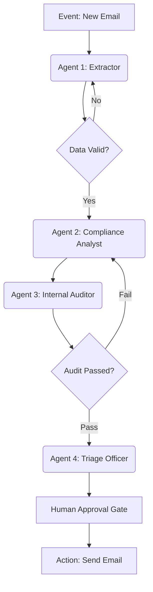

# 🚀 Implementation Plan: Unified Multi-Agent Enterprise Pipeline

This plan outlines the transformation of 4 standalone projects into a single, cohesive **Autonomous Compliance & Claims Pipeline**. This demonstrates senior-level mastery of multi-agent orchestration, state management, and production-grade AI safeguards.

## 🏢 Business Scenario: "The Autonomous Claims Desk"
A customer sends an email with an attachment (e.g., a receipt or invoice). The system must extract the data, verify it against complex company policies, audit the reasoning for hallucinations, and draft a response for human approval.

---

## 🤖 The 4 Agents (Unifying Projects 1-4)

| Agent | Original Project | Role in Pipeline |
|-------|------------------|------------------|
| **1. The Data Extractor** | `03-edge-ai-extraction` | **The Entry Point.** Uses the fine-tuned SLM (Phi-3) to turn raw unstructured data (OCR/Receipts) into a clean JSON schema. |
| **2. The Compliance Analyst** | `01-rag-policy-advisor` | **The Researcher.** Takes the JSON data and queries the Knowledge Base (ChromaDB) to determine if the claim meets policy criteria. |
| **3. The Internal Auditor** | `02-rag-evaluator` | **The Safety Gate.** Evaluates the Analyst's reasoning for Faithfulness and Relevancy *before* it reaches the human. If scores are < 0.8, it triggers a "Re-try" loop. |
| **4. The Triage Officer** | `04-email-triage-agent` | **The Finalizer.** Manages the Human-in-the-Loop (HITL) dashboard, presents the "Audit-Cleared" draft, and handles the final email dispatch. |

---

## 🏗️ Technical Orchestration (LangGraph)

We will use a **Multi-Agent StateGraph** to manage the flow and state.

### Multi-Agent Flow Diagram


---

## 📂 Proposed Structure

We will create a new top-level directory `00-multi-agent-pipeline` that imports logic from the existing projects.

```
00-multi-agent-pipeline/
├── app/
│   ├── main.py             # Unified FastAPI entry point
│   └── state.py            # LangGraph State definitions
├── core/
│   ├── graph.py            # The Multi-Agent orchestration logic
│   └── nodes/              # Adapters for each original project
│       ├── extract_node.py
│       ├── policy_node.py
│       ├── audit_node.py
│       └── triage_node.py
└── README.md               # The "Master" documentation
```

---

## 🚀 Execution Roadmap

### Step 1: Foundation (Today)
- Create `00-multi-agent-pipeline` directory.
- Define the global `AgentState` (JSON claim data, Policy findings, Audit scores, Email draft).
- Create `ARCHITECTURE_V2.md` to explain the "The Autonomous Claims Desk" narrative.

### Step 2: Agent Integration
- **Extractor:** Wrap `03` logic to return structured JSON.
- **Analyst:** Wrap `01` RAG logic to return policy-grounded text.
- **Auditor:** Wrap `02` metrics to score the Analyst's output.
- **Finalizer:** Integrate the `04` LangGraph logic as the final node.

### Step 3: The "Closed Loop" (The Wow Factor)
- Implement the **Self-Correction Loop**: If the Auditor (Agent 3) flags the Analyst (Agent 2), the Analyst must re-generate with a "Correction Prompt" that includes the Auditor's feedback.

### Step 4: Final Polish
- Unified Swagger UI for the whole pipeline.
- Single Langfuse trace that shows the "Hand-off" between all 4 agents.
- Updated `README.md` positioning you as a **Multi-Agent Systems Architect**.

---

> [!IMPORTANT]
> This transition doesn't replace projects 1-4; it uses them as modular "Skills" within a "System". You can still show the individual projects for deep-dives, but the Unified Pipeline becomes your **Main Feature**.
