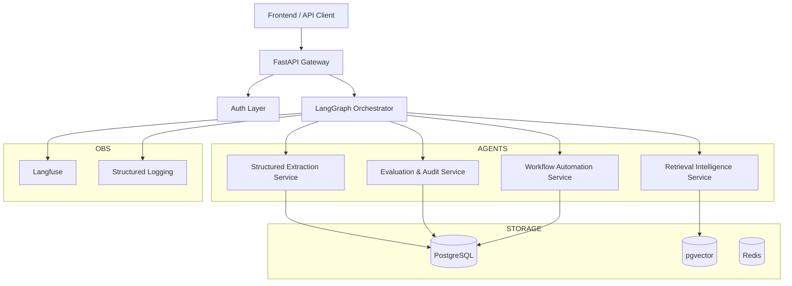
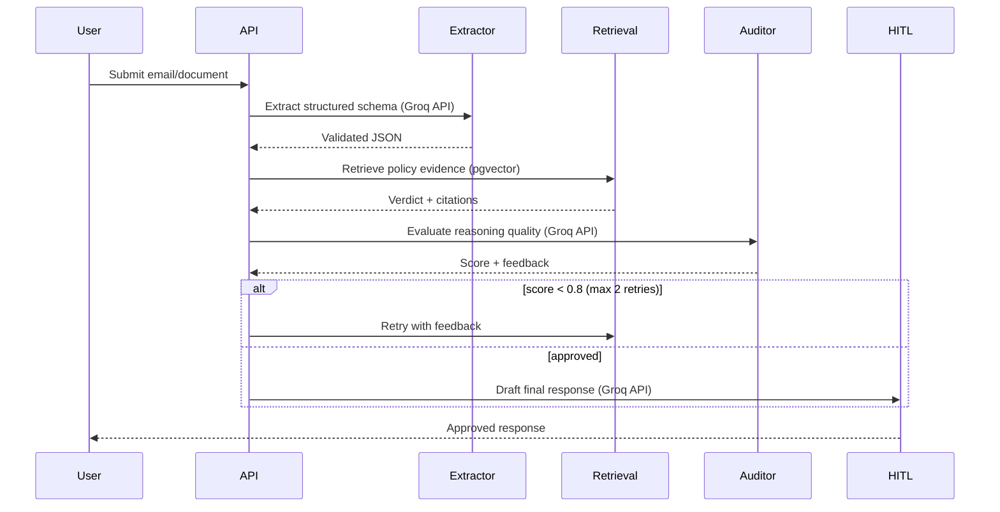

# 🏛️ Unified Enterprise AI Platform Architecture

> A production‑grade Compound AI System for compliance automation, retrieval intelligence, evaluation governance, and workflow orchestration.  
> **LLM backend:** Groq API (free tier) for all generation; optional local fine‑tuned model (HuggingFace `transformers`) for extraction.

---

## 1. Platform Vision

The system is a **unified AI platform** composed of four production capabilities:

| Capability                     | Purpose                                               |
| ------------------------------ | ----------------------------------------------------- |
| Structured Extraction Service  | Convert unstructured documents into validated schemas |
| Retrieval Intelligence Service | Research policies and retrieve evidence               |
| Evaluation & Audit Service     | Detect hallucinations and enforce quality             |
| Workflow Automation Service    | Generate responses and manage human approval          |

**Target use case:** Autonomous Compliance Desk  
- Receives customer emails/claims  
- Extracts structured information  
- Retrieves policy evidence  
- Audits reasoning quality  
- Drafts a response  
- Pauses for human approval  
- Resumes execution after approval  

---

## 2. Architectural Principles

- **Single backend** (modular services, unified codebase)  
- **Single authentication** (Supabase Auth)  
- **Single database** (PostgreSQL + pgvector)  
- **Async‑first** (all I/O: API, LLM calls, DB, Redis)  
- **Production observability** (Langfuse, structlog, Prometheus, Grafana)  
- **Evaluation‑driven reliability** (CI/CD quality gates)  
- **Cost governance** (token budgets, free Groq API)  

---

## 3. Infrastructure Stack

| Concern             | Final Choice                                                                 |
| ------------------- | ---------------------------------------------------------------------------- |
| API Backend         | FastAPI                                                                      |
| Agent Orchestration | LangGraph                                                                    |
| Database            | PostgreSQL (multi‑tenant, with `tenant_id`)                                  |
| Vector Search       | pgvector (hybrid BM25 + dense)                                               |
| Authentication      | Supabase Auth                                                                |
| Queue / Jobs        | Redis + Celery (background tasks, optional)                                  |
| Observability       | Langfuse + structlog + Prometheus + Grafana (optional)                       |
| ORM                 | SQLAlchemy 2                                                                 |
| Validation          | Pydantic v2                                                                  |
| **Primary LLM**     | **Groq API (free tier)** – Llama 3 70B / Mixtral 8x7B (fast, zero inference cost) |
| **Optional local**  | HuggingFace `transformers` + `peft` (Phi-3-mini, LoRA) – only for extraction, if needed |
| Embeddings          | OpenAI `text-embedding-3-small` (low cost, ~$0.13/1M tokens)                 |
| Deployment          | Docker Compose (local dev)                                                   |
| CI/CD               | GitHub Actions                                                               |

**Note on local models:** We do not use `llama.cpp`, GGUF, or offline API servers. If a local model is used (e.g., fine‑tuned Phi-3-mini), it runs inside the same Python process via `transformers`. However, the default and recommended path is **Groq API** for all generation – free, fast, and requires no GPU.

---

## 4. Runtime Architecture



---

## 5. Async‑First Rule (Mandatory)

All I/O‑bound operations must be asynchronous:

- FastAPI route handlers → `async def`
- Groq API calls → `async` client (e.g., `groq.AsyncGroq`)
- PostgreSQL sessions → `asyncpg` + SQLAlchemy async
- Redis operations → `redis.asyncio`
- LangGraph execution → async

```python
# REQUIRED
async def run_pipeline(...):

# FORBIDDEN
def run_pipeline(...):
```

No blocking I/O inside agents.

---

## 6. Multi‑Agent Workflow (LangGraph)



**Retry limit:** 2 attempts; after that, workflow escalates to human review.

---

## 7. Agent State (Pydantic / TypedDict)

```python
class AgentState(TypedDict):
    trace_id: str
    tenant_id: str
    user_id: str

    email_subject: str
    email_body: str

    extracted_claim: dict          # from Extractor

    retrieved_chunks: list[str]    # from Retrieval
    policy_verdict: str

    audit_score: float
    audit_feedback: str

    final_email_draft: str

    requires_approval: bool        # always True before HITL
    retry_count: int

    workflow_status: str
```

---

## 8. Tenant‑Aware Design (Multi‑tenant Ready)

All major entities include `tenant_id` and `user_id`:

- workflows
- documents
- embeddings
- evaluations
- traces
- audit logs

Enables SaaS readiness, workspace isolation, and future RBAC.

---

## 9. Data Architecture & Dataset Load Balancing

To scale handling of large regulatory and operational datasets (e.g., 1.4GB Enron corpus, multi-year SEC CSV collections) while adhering to strict Git hygiene and memory limits:

### Data Partitioning Scheme

| Layer | Location | Git | Management & Load Balancing Strategy |
| :--- | :--- | :--- | :--- |
| **Raw** | `data/raw/` | ❌ ignored | central raw repository, loaded via chunked streaming or lazy generators |
| **Processed** | `data/processed/` | ❌ ignored | indexed segments / SQLite files sharded by date/tenant |
| **Samples** | `data/samples/` | ✅ committed | representative subsets (e.g. 500 emails, 3 PDFs) for lightweight local test runs |
| **Evaluation** | `data/evaluation/` | ✅ committed | gold QA sets, regression tests, and evaluation bench sets |

### Dataset Load-Balancing & Scaling Concept

1. **Horizontal Index Sharding:** Vector and metadata tables in PostgreSQL/pgvector are partitioned using `tenant_id` and date boundaries. Queries only scan the partition indexes corresponding to the active context, minimizing memory footprint.
2. **Chunked Stream Loading (RAM Load-Balancing):** For heavy CSV ingestion (like the Enron dataset), the platform processes data using generator streams (e.g., pandas `chunksize` parameter or line-by-line streaming) to restrict RAM usage to under 256MB.
3. **Queue-Based Extraction (Compute Load-Balancing):** Ingestion pipelines distribute document extraction jobs across asynchronous Celery worker nodes. Workers use GPU/CPU load monitoring to balance processing weight, dynamically adjusting batch size.
4. **Semantic Cache Layers:** Frequent and repeated queries are cached at the edge via Redis to offload traffic from the databases and reduce Groq API/OpenAI embedding calls.

**Scripts:**
- `scripts/fetch_full_data.py` – downloads full datasets on demand (Kaggle/HuggingFace).
- `scripts/generate_sample.py` – creates representative samples and sharded partitions from full data.

---

## 10. Retrieval Pipeline (Hybrid + Reranking)

```text
Query
  ↓
BM25 (PostgreSQL full‑text)
  ↓
Dense (pgvector, OpenAI embeddings)
  ↓
Merge + Cross‑Encoder Reranking (cross-encoder/ms-marco-MiniLM)
  ↓
Context Compression (summarisation if too long)
  ↓
LLM Generation (Groq API)
```

**Embedding model:** `text-embedding-3-small` (OpenAI).  
**Reranker:** optional, improves top‑k relevance at inference cost.

---

## 11. Prompt Registry (Governed)

- Prompts stored as **Jinja2 templates** under `prompts/`
- Versioned, tested, traced in Langfuse
- Example:

```jinja2
You are a compliance analyst.

Claim:
{{ claim }}

Context:
{{ context }}

Provide a verdict with citations.
```

**No inline prompts in code.**

---

## 12. Unified LLM Layer (Abstraction)

All model calls pass through `LLMService`:

```python
class LLMService:
    async def generate(prompt, model="groq/llama3-70b", ...) -> str
    async def embed(texts) -> list[list[float]]
    async def evaluate(...) -> float  # for audit
```

**Features:**
- retries (exponential backoff, max 3)
- tracing (Langfuse)
- token accounting
- caching (Redis)
- fallback models (e.g., Groq → OpenAI if rate‑limited)
- timeout handling

**Default provider:** Groq API (free).  
**Optional local provider:** HuggingFace `transformers` (for fine‑tuned extraction) – can be enabled via config.

---

## 13. Background Worker Architecture (Optional)

Long tasks moved out of request lifecycle:

| Task                 | Worker       |
| -------------------- | ------------ |
| Document ingestion   | Celery       |
| Embedding generation | Celery       |
| Batch evaluation     | Celery       |

For local development, tasks can run inline (bypass Celery) via a configuration flag. The worker architecture demonstrates scaling readiness.

---

## 14. Cost Governance & Token Stewardship

**Primary LLM (Groq API):** $0 inference cost (free tier).  
**Embeddings (OpenAI):** ~$0.13 per 1M tokens.

| Agent | Tokens per Run | Cost per Run | Monthly (1,000 runs) |
| :--- | :--- | :--- | :--- |
| Extraction (Groq) | 800 | $0 | $0 |
| Retrieval + RAG (embeddings) | 1,500 | $0.0002 | $0.20 |
| Evaluation (Groq) | 1,200 | $0 | $0 |
| Triage (Groq) | 1,000 | $0 | $0 |
| **Total** | **4,500** | **~$0.0002** | **~$0.20** |

**Budget target:** < $1/month.  

**BudgetManager** enforces limits (max tokens per run, daily cost, automatic truncation).

---

## 15. Security & Governance

| Concern           | Mitigation                                         |
| ----------------- | -------------------------------------------------- |
| PII leakage       | Regex + NER masking before extraction              |
| Prompt injection  | Input sanitisation, length limits                  |
| API key exposure  | Centralised `.env`, never committed                |
| Unsafe automation | Mandatory HITL (`requires_approval` gate)          |
| Workflow auditing | Immutable audit logs (PostgreSQL)                  |

**Human Approval Model:** No outbound communication unless `requires_approval == False` after explicit human confirmation (via API or CLI).

---

## 16. Observability Stack

| Concern     | Tool                       |
| ----------- | -------------------------- |
| LLM tracing | Langfuse (trace_id per workflow) |
| Logs        | `structlog` (JSON, structured) |
| Metrics     | Prometheus (optional)      |
| Dashboards  | Grafana (optional)         |

**Metrics collected:** latency, token usage, retrieval quality, hallucination rate, workflow success rate, retry frequency, cost per workflow.

---

## 17. Repository Structure

```text
enterprise-ai-platform/
├── apps/
│   ├── api/               # FastAPI routes
│   └── worker/            # Celery tasks (optional)
├── agents/
│   ├── extraction/        # Agent 1 (Groq or local transformers)
│   ├── retrieval/         # Agent 2 (pgvector, hybrid)
│   ├── evaluation/        # Agent 3 (LLM-as-judge)
│   ├── workflow/          # Agent 4 (email triage)
│   ├── graph.py           # LangGraph orchestration
│   └── state.py           # AgentState
├── core/
│   ├── llm/               # LLMService (Groq, optional local)
│   ├── retrieval/         # Hybrid search, reranking
│   ├── prompts/           # Jinja2 templates
│   ├── observability/     # Langfuse, logging
│   ├── security/          # PII masking, auth
│   ├── budget/            # Token/cost governance
│   └── config.py
├── data/
│   ├── raw/               (ignored)
│   ├── processed/         (ignored)
│   ├── samples/           (committed)
│   └── evaluation/        (committed)
├── infrastructure/
│   ├── docker/
│   ├── github-actions/
│   └── migrations/
├── scripts/
├── tests/
├── docs/
├── pyproject.toml
├── docker-compose.yml
└── Makefile
```

---

## 18. Engineering Standards

| Area            | Standard             |
| --------------- | -------------------- |
| Formatting      | black (line‑length 100) |
| Linting         | ruff                 |
| Typing          | mypy (strict)        |
| Tests           | pytest + coverage >80% for core |
| Commits         | Conventional Commits |
| Dependency mgmt | `uv` or `pip-tools`  |
| Logging         | structlog            |
| Pre‑commit      | mandatory (black, ruff, mypy) |

---

## 19. CI/CD Quality Gates (GitHub Actions)

Every pull request triggers:

| Gate                    | Requirement                    |
| ----------------------- | ------------------------------ |
| Lint (`ruff`)           | pass                           |
| Typing (`mypy`)         | pass                           |
| Unit tests (`pytest`)   | pass                           |
| Retrieval regression    | no degradation on gold QA set  |
| Hallucination benchmark | faithfulness ≥ 0.85 (on sample)|
| Latency benchmark       | p95 < 3s per agent (Groq API)  |

---

## 20. Cleanup & Refactor Instructions

### Remove
- Duplicate utilities (e.g., multiple OpenAI clients)
- Inline prompts (move to `prompts/`)
- `print()` debugging (replace with `structlog`)
- Dead notebooks and commented code
- Mixed sync/async – enforce `async` everywhere

### Consolidate
- Shared modules into `core/` (retries, config, vector retrieval, logging, prompt loading, token accounting)

### Replace
- Direct `Groq()` or `OpenAI()` clients with `LLMService.generate(...)`

### Optional (if you keep local fine‑tuned model)
- Ensure `transformers`, `peft`, `torch` are in `pyproject.toml` (extras)
- Document how to enable local mode via environment variable `LLM_PROVIDER=local`

---

## 21. Deployment (Local Development)

```bash
docker-compose up
```

Services:
- FastAPI (port 8000)
- PostgreSQL + pgvector (port 5432)
- Redis (port 6379)
- Celery worker (optional)
- Langfuse (optional, can use cloud)

**No GPU required** because Groq API is used by default.

---

## 22. Strategic Positioning

This portfolio now aligns with:

- **AI Platform Engineering**
- **Applied AI Systems**
- **LLMOps / MLOps** (evaluation gates, tracing, cost governance)
- **Retrieval Engineering** (hybrid search, reranking)
- **Enterprise AI Infrastructure** (multi‑tenant, async, background workers)
- **Compound AI System Design** (LangGraph orchestration)

**Key differentiators:**
- Zero‑cost LLM inference via Groq API
- Evaluation‑driven development (CI/CD quality gates)
- Production‑ready data strategy (samples, scaling plan)
- Human‑in‑the‑loop governance

---

## 23. Final Outcome

This architecture transforms four individual projects into a **cohesive, enterprise‑grade Compound AI platform**. It demonstrates senior‑level engineering: stateful orchestration, hybrid retrieval, evaluation pipelines, cost stewardship, and a clear path to production.

> *“Not just four demos – one platform, built to scale.”*
