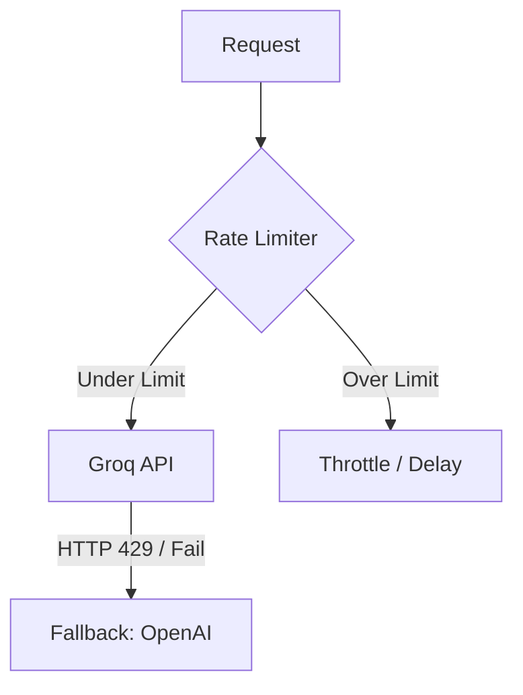

# 📈 Production Scaling: Load-Balancing & Partitioning Heavyweight Datasets

This document outlines the scaling strategies, load balancing architectures, and data partitioning techniques to support processing massive enterprise datasets (e.g., millions of emails, decades of SEC filings, and gigabytes of transaction logs) within the Enterprise Agent Runtime (EAR).

---

## 1. Overview of Data Load Scaling Challenges

When moving from development prototypes to production enterprise systems, dataset size becomes a key operational bottleneck:
- **Memory Consumption:** Loading a 1.4GB raw email CSV or 100MB+ transaction sheets directly into RAM can trigger Out-Of-Memory (OOM) faults on standard container instances.
- **Query Latency:** Searching over millions of embedding vectors in a single flat namespace slows down nearest-neighbor search ($O(N)$ or $O(\log N)$ search time scales with database size).
- **API and Rate Limits:** Blasting external embeddings or LLM APIs with millions of items simultaneously leads to rate-limiting errors (`429 Too Many Requests`).
- **Compute Starvation:** CPU-heavy tasks like local OCR (for Project 3) or LLM evaluation (for Project 2) can starve the API Gateway of CPU resources, making the service unresponsive.

To mitigate this, we employ **horizontal load balancing, stream-based lazy loading, and database sharding**.

---

## 2. Horizontal Index Sharding (Database Partitioning)

Rather than maintaining a single monolithic database index, we shard data horizontally to balance read/write operations:

### Multi-Tenant Workspace Sharding
All vector collections in pgvector and records in PostgreSQL are isolated by `tenant_id`. Database queries must include a filter on `tenant_id` which maps to a partitioned index structure.

### Date-Based Partitioning
For historical regulatory data (such as the SEC filings collection), data is partitioned by `year` and `quarter`. 
- **The DB Schema:** 
  ```sql
  CREATE TABLE sec_filings (
      id UUID PRIMARY KEY,
      ticker VARCHAR(10),
      filing_year INT,
      filing_quarter INT,
      content TEXT,
      embedding VECTOR(1536)
  ) PARTITION BY RANGE (filing_year);
  ```
- **Read-Load Balancing:** If a user queries AAPL's 2024 performance, the execution planner bypasses partitions from 2010 to 2023 entirely, narrowing the vector search space by over 90%.

---

## 3. Memory Load Balancing via Chunked Streaming

To prevent OOM container crashes, we enforce a strict **lazy evaluation / generator-based** data pipeline. Raw data files are processed in chunks rather than read entirely into memory.

### Implementation Blueprint: Chunked Stream Generator
```python
import pandas as pd
from typing import Generator, Dict, Any

def stream_heavy_dataset(
    file_path: str, 
    chunk_size: int = 1000
) -> Generator[pd.DataFrame, None, None]:
    """
    Streams a large CSV file in chunks to maintain a low memory profile.
    Ensures memory consumption remains bounded (e.g., < 256MB) regardless of file size.
    """
    try:
        # Load-balanced reading: chunksize returns an iterator instead of a fully loaded DataFrame
        for chunk in pd.read_csv(file_path, chunksize=chunk_size):
            yield chunk
    except FileNotFoundError:
        print(f"Dataset not found at {file_path}. Please fetch raw data first.")
```

---

## 4. Compute Load Balancing via Worker Queues (Celery + Redis)

Heavy workload nodes (RAG document parsing, OCR extraction, Batch Evaluators) are moved out of the synchronous FastAPI request lifecycle. We distribute work across load-balanced task queues:

```text
       FastAPI Gateway
              │
      (Dispatches Tasks)
              ▼
         Redis Queue
       ┌──────┴──────┐
       ▼             ▼
  Celery Worker 1  Celery Worker 2
 (Node A: CPU OCR) (Node B: GPU PEFT)
```

### Ingestion Load-Balancing Strategy
1. **Task Splitting:** A 500-page PDF document is split into 10-page segments.
2. **Queue Distribution:** 50 independent sub-tasks are pushed onto the Redis task broker.
3. **Dynamic Worker Scaling:** Multiple Celery workers process these sub-tasks concurrently. If Worker 1 experiences CPU throttling, the queue automatically redirects pending sub-tasks to Worker 2.

---

## 5. Token & Rate Limit Load Balancing

When executing high-throughput batch extraction or evaluation, we distribute requests to avoid API rate limits:

1. **Provider Load Balancing:** If the primary Groq API endpoint encounters rate limits (HTTP 429), the `LLMService` automatically shifts traffic to a fallback provider (e.g., OpenAI or an alternative model host) using exponential backoff logic.
2. **Rate Limiting Tokens (Token Stewardship):** The system uses a token bucket rate limiter to throttle requests, keeping traffic within free-tier Groq thresholds without crashing active runs.



---

## 6. Edge Semantic Caching (Redis)

To balance database search and LLM invocation loads, we employ **Semantic Caching**. 

If a new user query matches a previously asked question with a similarity score $> 0.96$:
- The RAG retrieval pipeline and LLM generation phases are bypassed completely.
- The cached response is served directly from Redis memory in under 5ms.
- This shifts search load away from pgvector and preserves Groq/OpenAI token budgets.
